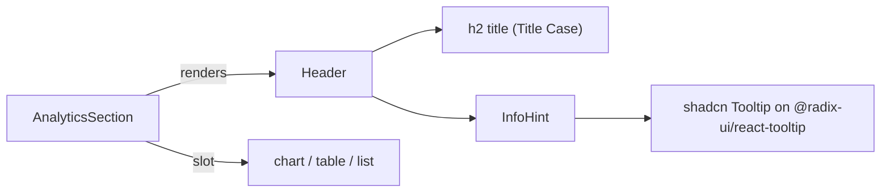

## Goal

Make Dashboard, Employees, and Insights feel like one polished enterprise HR analytics product: clear section boundaries, consistent heading typography, and discoverable explanations for HR-specific metrics. All work is frontend, TypeScript-strict, TDD-first, small commits.

## Architectural decisions (locked in)

1. Tooltip primitive: `@radix-ui/react-tooltip` via a small `frontend/src/components/ui/tooltip.tsx` shadcn primitive (hover + keyboard focus, ARIA `tooltip` role, portal-rendered). One global `<TooltipProvider>` mounted in `App.tsx`.
2. One reusable `<InfoHint>` component beside non-obvious headings. Accepts a `label` (short, used for aria-label) and `children` (longer description). Renders as a focusable button + 14px `Info` icon (lucide).
3. One reusable `<AnalyticsSection>` wrapper enforces the card pattern: white background, slate-200 border, `rounded-lg`, subtle shadow, `p-4 sm:p-6`, `space-y-3`, optional `actions` slot on the right of the header. Owns the `h2` heading + optional `<InfoHint>`, so children stay focused on content.
4. Heading capitalization (USER-VISIBLE only per your decision): all `h1`/`h2`/`h3`/`h4`, chart titles, KpiCard labels, table column headers. Excluded: aria-labels, status/empty messages, button labels, form input labels, tooltip body text. Edits are inline at the call site — no `headings.ts` constants file (over-engineering for ~10 strings).
5. Payroll layout: drop the `lg:grid-cols-2` and stack vertically with `space-y-4` so each chart gets the full content width on every breakpoint. PayrollBreakdown also loses its internal `<h3>` (the wrapping `<AnalyticsSection>` provides the heading).

## Reusable abstractions introduced

- `frontend/src/components/ui/tooltip.tsx` — Radix-based shadcn primitive (`Tooltip`, `TooltipTrigger`, `TooltipContent`, `TooltipProvider`).
- `frontend/src/components/InfoHint.tsx` — `<InfoHint label="...">explanation</InfoHint>`. Single canonical info-icon affordance.
- `frontend/src/components/AnalyticsSection.tsx` — `<AnalyticsSection title="..." tooltip={<>…</>} actions={<>…</>}>...</AnalyticsSection>`. Renders the card, header, optional InfoHint, optional right-aligned actions, and the children area.

## Files changed (frontend only)

### New

- `frontend/src/components/ui/tooltip.tsx` — shadcn primitive (~30 lines).
- `frontend/src/components/InfoHint.tsx` + `InfoHint.test.tsx`.
- `frontend/src/components/AnalyticsSection.tsx` + `AnalyticsSection.test.tsx`.

### Updated

- [frontend/src/App.tsx](frontend/src/App.tsx) — wrap router in `<TooltipProvider delayDuration={150}>`.
- [frontend/src/pages/InsightsPage.tsx](frontend/src/pages/InsightsPage.tsx):
  - Wrap KPI cards, by-title chart, payroll burden, outliers in `<AnalyticsSection>`.
  - Title-Case: `Average Salary by Job Title`, `Total Compensation Burden`, `Compensation Outliers`, plus a new `Country Overview` heading for the KPI grid.
  - Stack PayrollBreakdown vertically: drop `lg:grid-cols-2`, use `space-y-4`. Two nested `<AnalyticsSection>` for `By Job Title` (first) then `By Country` (per your spec).
  - Country selector moves into the page header's `actions` slot.
  - Add `<InfoHint>` to `Average Salary by Job Title`, `Total Compensation Burden`, `Compensation Outliers`.
- [frontend/src/pages/DashboardPage.tsx](frontend/src/pages/DashboardPage.tsx):
  - Wrap `Employees by Country` and `Recent Hires` in `<AnalyticsSection>` with `<InfoHint>`.
  - Title-Case `Average Salary`, `Job Titles` KpiCard labels.
  - Title-Case `Employees by Country`, `Recent Hires`.
- [frontend/src/components/PayrollBreakdown.tsx](frontend/src/components/PayrollBreakdown.tsx):
  - Drop internal `<h3>` header (AnalyticsSection owns it).
  - Keep the "Total payroll: X" summary as a small caption rendered above the chart (still inside the wrapping section).
- [frontend/src/components/OutlierTables.tsx](frontend/src/components/OutlierTables.tsx):
  - Title-Case `BUCKET_LABEL`: `Bottom 5% — Retention Risk`, `Top 5% — Budget Review`.
  - Keep the section sub-headings as small `<h3>` inside two columns (still useful contrast — Bottom vs Top).
- [frontend/src/components/EmployeesTable.tsx](frontend/src/components/EmployeesTable.tsx):
  - Widen the `columns` array element type from `string` to `string | ReactNode` so `Compa` and `Spread` can render `<>{label} <InfoHint .../></>`. Keep `key={typeof col === 'string' ? col : index}`.
- [frontend/src/components/SalaryBarChart.tsx](frontend/src/components/SalaryBarChart.tsx) — remove its own border/rounded card so it sits cleanly inside `<AnalyticsSection>` (still rounded inside, but no double-border).

### Test updates (no behavior regressions)

- [frontend/src/pages/InsightsPage.test.tsx](frontend/src/pages/InsightsPage.test.tsx) — Title-Case heading matchers, plus a new assertion that an info-tooltip button exists beside `Total Compensation Burden`.
- [frontend/src/pages/DashboardPage.test.tsx](frontend/src/pages/DashboardPage.test.tsx) — Title-Case heading matchers, tooltip presence beside `Employees by Country`.
- [frontend/src/pages/EmployeesPage.test.tsx](frontend/src/pages/EmployeesPage.test.tsx) — assert info-tooltip buttons named `Compa` and `Spread` are present when analyses are loaded.

## Commit sequence (TDD-first, ~12 commits)

### Phase J — primitives
1. `chore(fe): add @radix-ui/react-tooltip; ui/tooltip primitive + TooltipProvider in App`
2. `test(fe): InfoHint renders an accessible info button revealing the description`
3. `feat(fe): InfoHint reusable wrapper on shadcn Tooltip`
4. `test(fe): AnalyticsSection renders a titled card with optional InfoHint`
5. `feat(fe): AnalyticsSection wrapper component`

### Phase K — capitalization sweep (single refactor, no behavior change)
6. `refactor(fe): Title Case headings + KpiCard labels across Dashboard, Insights, PayrollBreakdown, OutlierTables`

### Phase L — Insights page restructure
7. `test(fe): InsightsPage uses AnalyticsSection wrappers; payroll stacks vertically; tooltip beside Total Compensation Burden`
8. `feat(fe): Insights page card layout + vertical payroll + tooltips`

### Phase M — Dashboard tooltips
9. `test(fe): DashboardPage wraps sections in AnalyticsSection; tooltip beside Employees by Country`
10. `feat(fe): wrap Dashboard sections in AnalyticsSection + tooltips`

### Phase N — Employees table Compa/Spread tooltips
11. `test(fe): EmployeesTable Compa and Spread column headers expose info tooltips`
12. `feat(fe): EmployeesTable column headers accept ReactNode; add InfoHint on Compa + Spread`

## Tooltip copy (canonical, used inline at call sites)

- Dashboard / `Employees by Country` — "Headcount distribution across countries. Useful for spotting concentration of risk or growth opportunities."
- Dashboard / `Recent Hires` — "Most recently added employees. Useful for onboarding follow-ups and audit trails."
- Employees / `Compa` — "Compa-ratio: salary ÷ peer-group average. Below 80% may indicate underpayment risk; above 120% may need budget review."
- Employees / `Spread` — "Range penetration: where the salary sits between peer-group min and max. 0% = floor, 100% = ceiling."
- Insights / `Average Salary by Job Title` — "Mean salary per role within the selected country. Roles with one employee show that employee's salary."
- Insights / `Total Compensation Burden` — "Total payroll cost distributed by country and by role. Use this to monitor budget concentration."
- Insights / `Compensation Outliers` — "Lowest 5% (retention risk) and highest 5% (budget review) within each peer group of role and country."

## Testing strategy

- Unit/behavioral: new `InfoHint.test.tsx` + `AnalyticsSection.test.tsx` cover the primitives.
- Page-level: updated `InsightsPage.test.tsx`, `DashboardPage.test.tsx`, `EmployeesPage.test.tsx` assert the new headings and the presence of an info-button (`getByRole('button', { name: /<label>/i })`). Avoid asserting tooltip popup text directly — Radix portals it on hover/focus and that adds flake; the aria-label and rendered content of the trigger are sufficient.
- jsdom polyfills already include `ResizeObserver`, `PointerEvent`, `scrollIntoView` from Phase E — Radix Tooltip uses the same primitives, so no further setup is expected. If a Radix popup needs `DOMRect.toJSON` (rare), add it to the same setup file.
- All existing 71 frontend tests must stay green; backend untouched.

## Scalability / accessibility notes

- `TooltipProvider` at the app root means future analytics sections only call `<InfoHint>` — zero per-call configuration.
- `<AnalyticsSection>` is a one-line wrapper that future advanced metrics (e.g., retention risk, equity-band coverage) can adopt without copy-pasting card styling.
- Tooltips are keyboard accessible (Tab to focus the button, tooltip shows; Esc to dismiss).
- Color contrast: card uses `bg-white` on `bg-slate-50` page background — ≥ 1.5:1 separation; section heading `text-slate-900` on `bg-white` is 21:1.
- No new fonts, no new colors, no animation libraries.

## What this plan does NOT do

- No backend changes.
- No new analytics metrics.
- No design-token system (Tailwind classes inline; the `AnalyticsSection` wrapper is the single source of section styling).
- No centralized headings constants file (~10 strings; YAGNI per craftsmanship rule).
- No global Tailwind theme tweaks.