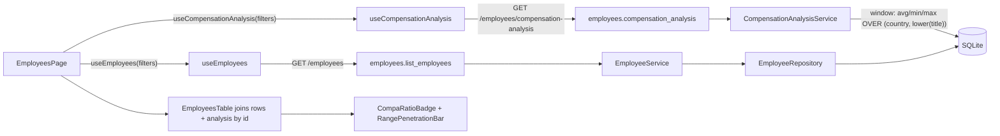

# Salary Management — Bug Fixes & Advanced HR Analytics

## Goals

- Fix 3 defects: job-title case sensitivity, country case sensitivity on Insights, Recharts Y-axis clipping.
- Ship 3 enhancements: searchable country combobox (shadcn), "Showing X–Y of N" pagination, advanced HR analytics (compa-ratio, range penetration, payroll burden, outliers).
- Keep clean architecture; reuse existing service/repository pattern; add new files only where boundaries demand it.

## Architectural decisions (locked in)

1. **Job-title normalization**: query-side via `func.lower(Employee.job_title)`, displayed title-cased in aggregation responses. No new column, no functional index (10k row corpus). Captured as a single shared `title_canonical` expression to avoid duplication.
2. **Country normalization**: Pydantic validator on `EmployeeBase.country` coerces to uppercase on write; routes that accept `country` (path or query) uppercase it before reaching repo/service. Storage stays uppercase.
3. **Recharts Y-axis**: extract a reusable `<SalaryBarChart>` wrapper that sets `<YAxis width={80}>`, `tickFormatter` with K/M suffixes, and `margin={{ left: 16, right: 16 }}`. `TitleAveragesChart` and new payroll charts both consume it.
4. **Pagination total**: `lib/api.ts` grows `apiFetchWithMeta<T>` returning `{ data, totalCount }`; `employeesApi.list` returns `{ rows, total }`; `<Pagination>` takes a `total` prop. Header is already exposed via CORS in [app/main.py](app/main.py).
5. **Country combobox**: install shadcn primitives (`cmdk`, `@radix-ui/react-popover`). New `Combobox` (generic) + `CountryCombobox` (concrete) consume a new `useDistinctCountries(filters)` hook backed by a new `GET /employees/countries` endpoint that reuses the same filter chain as `/employees`.
6. **Compa-Ratio / Range Penetration**: separate endpoint `GET /employees/compensation-analysis`, returning a per-employee map keyed by `id`. Implemented via a single SQLAlchemy window-function query in a new `CompensationAnalysisService` (peer group = `(country, lower(job_title))`).
7. **Payroll Burden**: two endpoints `GET /insights/payroll/by-country` and `/by-title`, returning `[{key, total, percentage}]`.
8. **Outliers**: one endpoint `GET /insights/outliers?bucket=bottom|top&min_group_size=5&limit=20` using `NTILE(20) OVER (PARTITION BY country, lower(title) ORDER BY salary)`. Bottom = bucket 1, top = bucket 20. Groups with fewer than `min_group_size` peers are skipped to avoid noise.

## Data flow (compensation analysis)

## Files affected (high level)

### Backend

- [app/models/employee.py](app/models/employee.py) — no change.
- [app/schemas/employee.py](app/schemas/employee.py) — `EmployeeBase.country` + `EmployeeUpdate.country` get a `BeforeValidator` that uppercases.
- [app/repositories/employee_repository.py](app/repositories/employee_repository.py) — add `distinct_countries(filters)`; keep `_filtered` (used by both list and the new endpoint).
- [app/services/employee_service.py](app/services/employee_service.py) — add `distinct_countries(...)` passthrough.
- [app/services/salary_insights_service.py](app/services/salary_insights_service.py) — switch every `Employee.job_title` group/order to a shared `_title_canonical` (`func.lower(...)`), display via `_display_title` helper. Add `payroll_by_country()`, `payroll_by_title()`, `salary_outliers(...)`.
- New: `app/services/compensation_analysis_service.py` — `analyze(filters)` returning `{id: {avg_peer, min_peer, max_peer, compa_ratio, range_penetration}}`.
- New: `app/schemas/analytics.py` — `EmployeeCompensationAnalysis`, `CompensationAnalysisResponse`, `PayrollEntry`, `OutlierEntry`.
- [app/api/routes/employees.py](app/api/routes/employees.py) — add `GET /employees/countries` and `GET /employees/compensation-analysis`. Uppercase incoming `country` query param.
- [app/api/routes/insights.py](app/api/routes/insights.py) — uppercase incoming path `country`; add `/insights/payroll/by-country`, `/insights/payroll/by-title`, `/insights/outliers`.

### Frontend

- [frontend/src/lib/api.ts](frontend/src/lib/api.ts) — add `apiFetchWithMeta`.
- [frontend/src/services/employees.ts](frontend/src/services/employees.ts) — list returns `{ rows, total }`; add `countries(filters)` and `compensationAnalysis(filters)`.
- [frontend/src/services/insights.ts](frontend/src/services/insights.ts) — add `payrollByCountry`, `payrollByTitle`, `outliers`.
- [frontend/src/services/types.ts](frontend/src/services/types.ts) — new types for analytics.
- [frontend/src/hooks/useEmployees.ts](frontend/src/hooks/useEmployees.ts) — return `{ rows, total }`.
- New hooks: `useDistinctCountries`, `useCompensationAnalysis`, `usePayrollBurden`, `useOutliers`.
- New shadcn primitives: `frontend/src/components/ui/popover.tsx`, `frontend/src/components/ui/command.tsx`.
- New components: `Combobox`, `CountryCombobox`, `CompaRatioBadge`, `RangePenetrationBar`, `SalaryBarChart`, `PayrollBreakdown`, `OutlierTables`.
- Updated: [frontend/src/components/EmployeesFilters.tsx](frontend/src/components/EmployeesFilters.tsx) (uses `CountryCombobox`), [frontend/src/components/EmployeesTable.tsx](frontend/src/components/EmployeesTable.tsx) (compa-ratio + spread columns when analysis data present), [frontend/src/components/Pagination.tsx](frontend/src/components/Pagination.tsx) (renders "of N"), [frontend/src/components/TitleAveragesChart.tsx](frontend/src/components/TitleAveragesChart.tsx) (delegates to `SalaryBarChart`), [frontend/src/pages/EmployeesPage.tsx](frontend/src/pages/EmployeesPage.tsx), [frontend/src/pages/InsightsPage.tsx](frontend/src/pages/InsightsPage.tsx) (combobox + payroll + outlier sections).

## Reusable abstractions added

- Backend: `title_canonical` SQL expression, `display_title()` helper, `EmployeeRepository.distinct_countries()`, `CompensationAnalysisService`, `salary_outliers()`.
- Frontend: `apiFetchWithMeta`, generic `Combobox`, `SalaryBarChart` wrapper, `CompaRatioBadge` (3 thresholds, ARIA label, tooltip), `RangePenetrationBar`.

## Testing strategy

- **Backend**:
  - Unit (`tests/unit/test_salary_insights_service.py`, new `test_compensation_analysis_service.py`): case-insensitive grouping, compa-ratio math (avg-anchored), range-penetration math, outlier NTILE, payroll percentages summing to 100.
  - Integration (`tests/integration/test_employees_api.py`, `test_insights_api.py`): new endpoints, case-insensitive `country` path + query, schema validators.
- **Frontend**:
  - Component (`Combobox.test.tsx`, `CountryCombobox.test.tsx`, `CompaRatioBadge.test.tsx`, `RangePenetrationBar.test.tsx`, `Pagination.test.tsx` updated, `SalaryBarChart.test.tsx`).
  - Page (`EmployeesPage.test.tsx`, `InsightsPage.test.tsx`): combobox interaction, pagination "of N", compa-ratio column appears, payroll + outlier sections render.

## Scalability notes (documented in `artifacts/tradeoffs.md`)

- Window functions on SQLite are O(n log n) per partition — at 10k rows ~negligible.
- `LOWER()` on every aggregation defeats the existing `ix_employees_job_title` btree; for >100k rows add a functional index. Noted but not built.
- Compensation-analysis endpoint applies the same `country`+`q` filters as `/employees` so the map only carries the rows the page actually displays.

## Recommended commit sequence (top-down, one TDD pair per bullet)

### Phase A — Title case insensitivity
1. `test: SalaryInsightsService aggregates by lowercase title`
2. `feat: aggregate insights by lower(job_title); title-case display`
3. `refactor: extract title_canonical/display_title helpers`

### Phase B — Country case insensitivity
4. `test: EmployeeBase.country uppercases on write`
5. `feat: BeforeValidator uppercases country in schemas`
6. `test: GET /insights/by-country/in matches /IN`
7. `feat: insights + employees routes uppercase country`
8. `test(fe): InsightsPage sends uppercased country to API`
9. `feat(fe): InsightsPage normalizes country on send`

### Phase C — Recharts y-axis fix
10. `test(fe): SalaryBarChart YAxis width prevents label clipping`
11. `feat(fe): reusable SalaryBarChart wrapper with safe margins`
12. `refactor(fe): TitleAveragesChart delegates to SalaryBarChart`

### Phase D — Pagination summary
13. `test(fe): apiFetchWithMeta returns {data, totalCount}`
14. `feat(fe): apiFetchWithMeta`
15. `test(fe): employeesApi.list returns {rows, total}`
16. `feat(fe): list parses X-Total-Count`
17. `test(fe): Pagination renders "Showing 1–25 of 100"`
18. `feat(fe): Pagination accepts total; pages thread it through`

### Phase E — Country combobox
19. `chore(fe): add cmdk + @radix-ui/react-popover; scaffold shadcn ui primitives`
20. `test: GET /employees/countries returns [{code,count}] respecting filters`
21. `feat: GET /employees/countries endpoint + repository.distinct_countries`
22. `test(fe): useDistinctCountries hits /employees/countries with filters`
23. `feat(fe): useDistinctCountries hook`
24. `test(fe): Combobox keyboard select + filter typing`
25. `feat(fe): generic Combobox built on Popover + Command`
26. `test(fe): CountryCombobox uses live distinct countries`
27. `feat(fe): CountryCombobox + replace inputs on Employees + Insights`

### Phase F — Compa-Ratio + Range Penetration
28. `test: CompensationAnalysisService.analyze returns map with compa_ratio + range_penetration`
29. `feat: CompensationAnalysisService (window-function query)`
30. `test: GET /employees/compensation-analysis returns the same filtered set`
31. `feat: route + schemas`
32. `test(fe): CompaRatioBadge color + ARIA per threshold`
33. `feat(fe): CompaRatioBadge`
34. `test(fe): RangePenetrationBar renders percent + ARIA`
35. `feat(fe): RangePenetrationBar`
36. `test(fe): EmployeesPage shows compa-ratio column when analysis loaded`
37. `feat(fe): wire useCompensationAnalysis + table columns`

### Phase G — Payroll burden
38. `test: payroll_by_country totals + percentages sum to 100`
39. `feat: PayrollBurdenService methods`
40. `test: /insights/payroll/by-country and /by-title`
41. `feat: routes + schemas`
42. `test(fe): InsightsPage renders payroll breakdown`
43. `feat(fe): PayrollBreakdown section using SalaryBarChart`

### Phase H — Outlier detection
44. `test: salary_outliers bottom 5%/top 5% with min_group_size guard`
45. `feat: NTILE-based salary_outliers in insights service`
46. `test: /insights/outliers?bucket=bottom returns peers + bucket`
47. `feat: route + schema`
48. `test(fe): InsightsPage renders Top/Bottom 5% tables`
49. `feat(fe): OutlierTables section`

### Phase I — Documentation sweep
50. `docs: tradeoffs.md — title/country normalization, compa-ratio separate endpoint, NTILE outliers`
51. `docs: manual-test-scenarios for combobox, pagination total, compa-ratio, payroll, outliers`
52. `docs: README API table + lessons.md (window/NTILE quirks)`

Total target: ~52 commits, all small, each with the `test:` commit immediately preceding the `feat:`/`refactor:` commit so the git log reads as visible TDD.